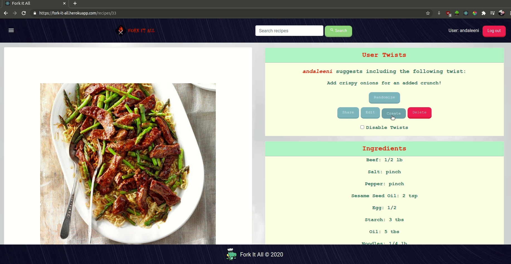
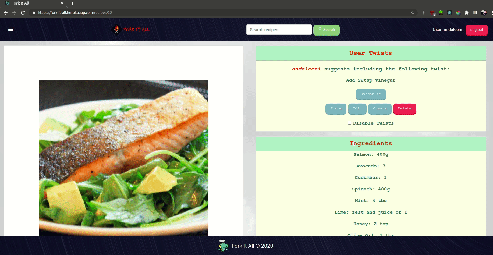
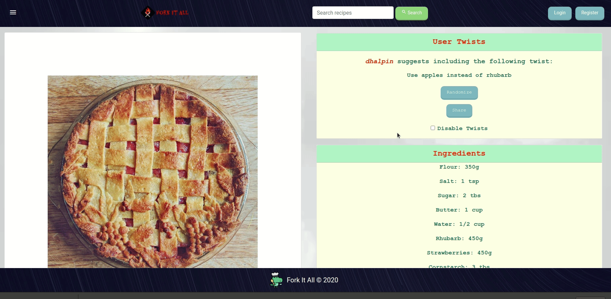
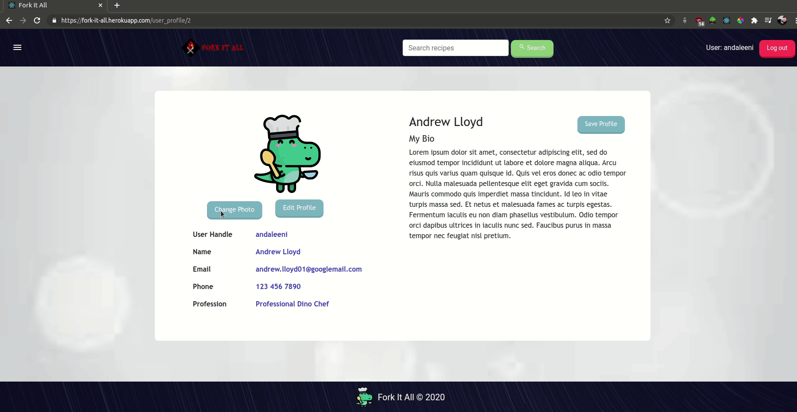

# Fork It All

Have you ever followed a recipe and thought this could do with another pinch of \_\_\_\_? Have you ever found the perfect recipe… almost? Fork It All allows you to create your own twist on recipes. You will be able to see a list of user shared twists to recipes too. Twist cuts out the life stories so you can get straight to business in your kitchen! <br/>
[Find the backend repository here](https://github.com/kelsi2/fork_it_all_backend)

## Table of Contents

- [Tech Stack](#tech-stack)
- [User Stories](#user-stories)
- [Screenshots](#screenshots)
- [Development](#development)
  - [Dependencies](#dependencies)
  - [Fork It All Setup](#fork-it-all-setup)
  - [Running the Server](#running-the-server)

## Tech Stack

- React
- React Router
- React Bootstrap
- Sass
- Deployment: Heroku

## User Stories

- As a user, I want to be able to access clear and concise existing recipes and other users' associated twists on them.
- Users should have the ability to see a list of publicly available twists on the home page
- As a user I want to be able to create a twist on a recipe
- Users should be able to make twists private
- Users should have the option to categorize their twists associated with a recipe
- Users should have the ability to pin/save/favourite other users' twists
- Users who have created their twists should be able to delete only their twists
- As a user I want to be able to edit an existing twist I have made
- As a user I want to be able to share my twists on existing recipes
- As a user I should be able to share a link to a twist I create

## Screenshots











# Development

### Dependencies

- Axios
- Bootstrap
- Copy-to-clipboard
- Create React App
- Faker
- Node-Sass
- React Bootstrap
- React Dom
- React Router Dom

### Fork It All Setup

```
cd <project-directory>
git clone https://github.com/DevHalpin/fork_it_all_frontend
cd fork_it_all_frontend
npm i
```

- Be sure to run the [backend](https://github.com/kelsi2/fork_it_all_backend) install as well.

### Running the server

Run `npm start` in a terminal to start front end
